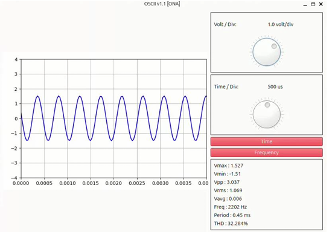
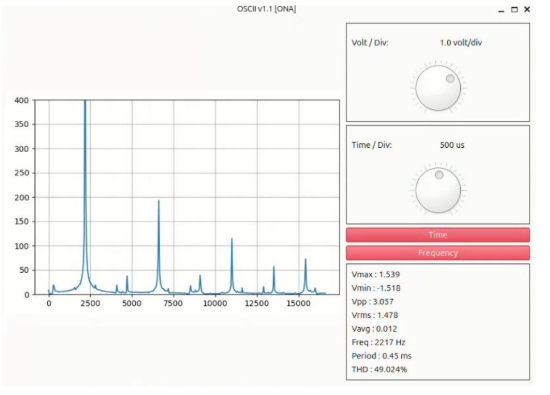

# Wi-Fi-Based Oscilloscope using Raspberry Pi Pico W

## Overview

This project presents a Wi-Fi-based oscilloscope built with a **Raspberry Pi Pico W** microcontroller. It wirelessly transmits signal data to a Python-based GUI developed with **PyQt6**, enabling real-time visualization of waveforms and frequency-domain analysis. The oscilloscope is capable of displaying time-domain signals, FFT (Fast Fourier Transform) spectra, and key waveform characteristics.

**Time-Domain Signal Visualization**



**Frequency-Domain (FFT) Analysis**



---

## Technologies Used

- **Microcontroller:** Raspberry Pi Pico W  
- **Firmware Development:** C SDK (Pico SDK)  
- **GUI Development:** Python 3, PyQt6  
- **Communication Protocol:** TCP/IP over Wi-Fi  
- **FFT Processing:** NumPy (in Python)

---

## 🛠️ How to Build and Run the Project

Before building the firmware, set up the toolchain by following these official Raspberry Pi documents:

- 📘 [Getting Started with Raspberry Pi Pico](https://datasheets.raspberrypi.com/pico/getting-started-with-pico.pdf)  
- 🌐 [Connecting to the Internet with Pico W](https://datasheets.raspberrypi.com/picow/connecting-to-the-internet-with-pico-w.pdf)

Once your environment is ready, build the firmware as follows:

### 1. Build Firmware for Pico W

```bash
cd pico-w/
mkdir build
cd build
export PICO_SDK_PATH=../../pico-sdk   # Adjust based on your setup
cmake -DPICO_BOARD=pico_w ..
make
```

After building, you will find the `.uf2` executable in the `build/` directory.

### 2. Flash the Firmware

1. Disconnect the Pico W.
2. Press and hold the **BOOTSEL** button (or connect BOOTSEL pin to GND if using breadboard).
3. While holding the button, plug in the Pico W via USB. It will appear as a USB flash drive.
4. Drag and drop the generated `.uf2` file (e.g., `test.uf2`) into the drive.

The device will reboot and begin broadcasting a Wi-Fi network.

---

### 3. Connect to the Device

Connect your computer to the following Wi-Fi access point:

```
SSID: wifi_based_oscii  
Password: esekku2024
```

Once connected, you are ready to launch the GUI.

---

### 4. Launch the GUI (Python PyQt6)

Ensure Python 3 and required libraries are installed:

```bash
pip install pyqt6 numpy matplotlib
```

Then run the GUI:

```bash
cd OSCIIv1.1/
python main.py
```

---

## ✨ Features

- Real-time time-domain waveform display
- Frequency-domain FFT analysis
- Signal metrics: Vrms, Vavg, Vpp, Frequency, Period, THD, etc.
- Adjustable voltage and time division
- Drag-and-drop firmware flashing
- Simple Python interface with PyQt6

---

## ⚠️ Disclaimer

In the real hardware implementation of this project, an analog front-end circuit was designed to offset the input signal voltage before feeding it into the ADC of the Raspberry Pi Pico W. This ensures that the ADC operates within its 0–3.3V input range and prevents negative voltage damage.

However, **for demonstration or testing purposes**, you can still use this project with **DC signals** that are within the safe input range of the Pico W's ADC **(0 to 3.3V)**, even without the offset circuit. Always ensure the input signal does not exceed the voltage range to avoid damaging your microcontroller.